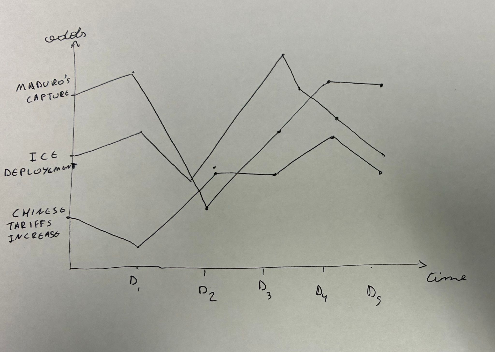

# A Cross-Market Prediction Basket for the most impactful news stories
Group: wiggly-donut

## 1) What dataset are you going to use? (include link)
We want to build a live dashboard that tracks news-focused prediction markets across multiple platforms (starting with Kalshi and Polymarket). Prediction markets are useful because they aggregate public opinion into an implied probability, often producing surprisingly strong forecasts in practice. We want to create a cross-market “basket” signal instead of treating any one platform as ground truth. By combining probabilities across these sites, we get a more robust read of what expectations are shifting in real time.

We want to do this because of the news relevance. Prediction prices move when new information arrives, so the biggest probability changes over the last week can act like a filter for current affairs on the things that have changed massively. Concretely, we’ll ingest market data from Kalshi’s public market-data endpoints and Polymarket’s read-only Gamma Markets API, compute “top movers,” and then link each moving market to the most relevant headlines via NewsAPI. 

The News API: https://www.thenewsapi.com/

Kalshi API: https://docs.kalshi.com/welcome

Polymarket API: https://docs.polymarket.com/quickstart/overview

## 2) What are your research question(s)? (specific + answerable)
RQ1: Which 10–20 news-related prediction markets show the largest change in implied probability over the last 7 days (or last 24h), across a combined basket of prediction markets?

RQ2: What type of news provokes the most significant movement on prediction markets?

RQ3: What are the most common volatile prediction topics/placements over a week period and how are their evolution correlated with news cycle
 

## 3) What’s the link to your notebook?
Notebook link:https://github.com/nav-v/adv-comp-project/blob/main/proposal.ipynb

## 4) What’s your target visualization? (include a picture)

Target dashboard layout (2-panel, interactive):

Top panel: “Top Movers (Last 7 Days) - shown above.

The top panel will have line charts showing the top 10/20 markets by probability change. Each chart will show the basket’s implied probability over time (e.g., last 7d). The x axis would be time, whilst the y exist would be implied probability.

Bottom panel: “What’s the story?”

When you click a market in the top panel, the page scrolls/jumps to a details section showing:

Market title + platform(s)

Latest probability + 7d change

Relevant headlines pulled from NewsAPI (title, source, timestamp, link), using the market’s keywords.

## 5) What are your known unknowns?
Matching across platforms: there’s no guarantee Kalshi/Polymarket list the same questions. Similar problem for the NewsAPI – how do we get news reports for associated questions. This might be the hardest bit.

API rate limits: It seems like all three APIs have free tiers – but we need to read in-depth on their limitations.

Database-related concerns: Might need to set up a database to do the weeklong basket tracking. Unsure how this works.

## 6) What challenges do you anticipate?
Honestly a lot of unknown unknowns – like setting up the database

UX/UI might be a problem too – need to figure out whether the dashboard described above is the best way to show the most relevant news articles.